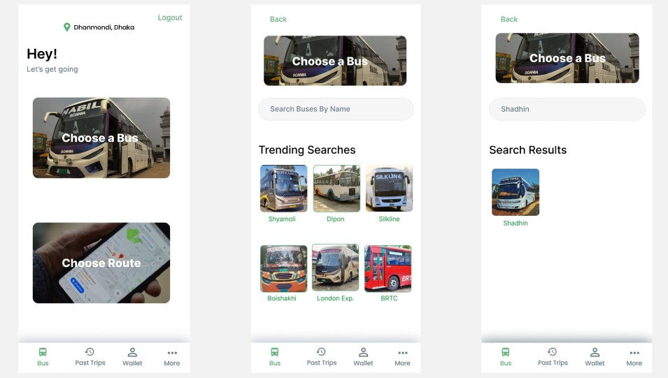
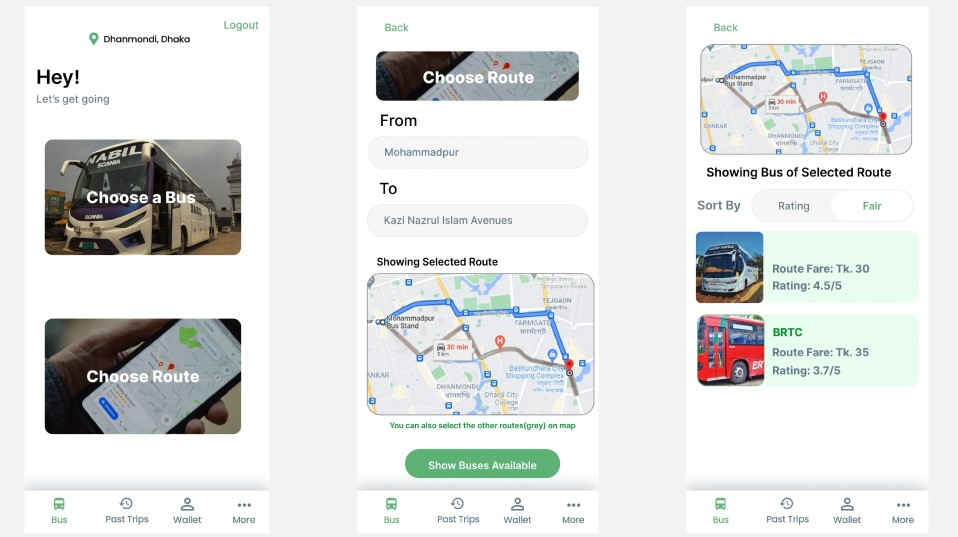
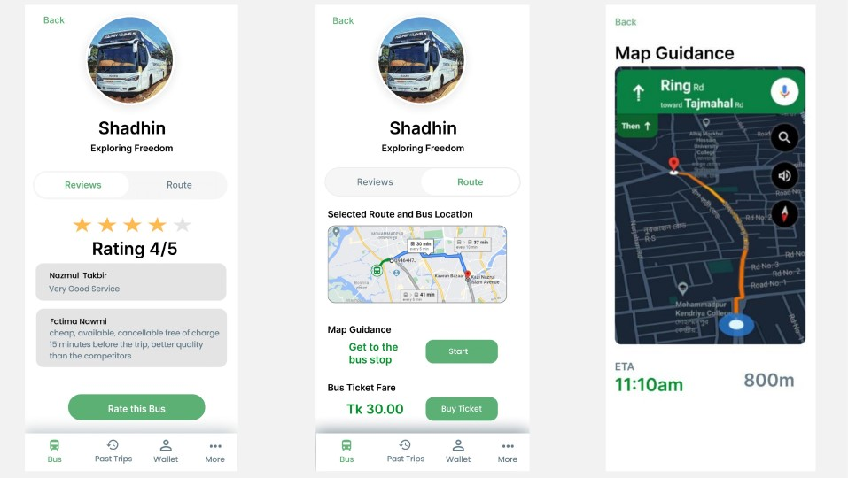
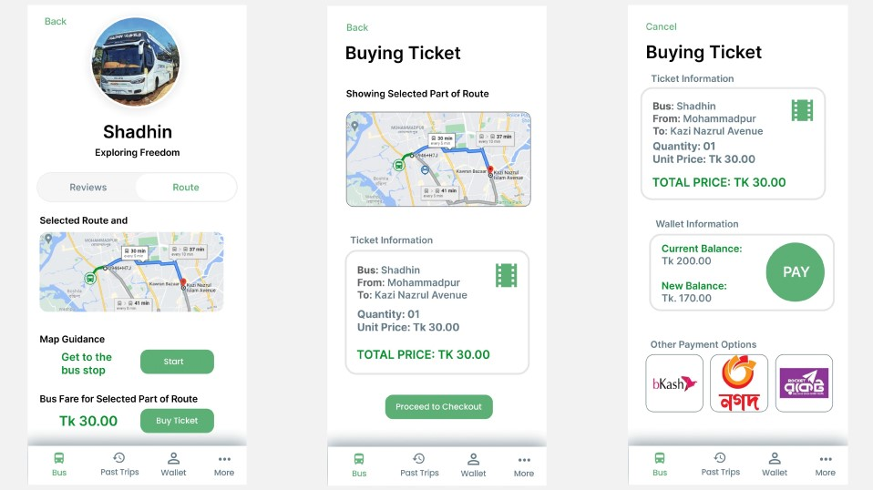
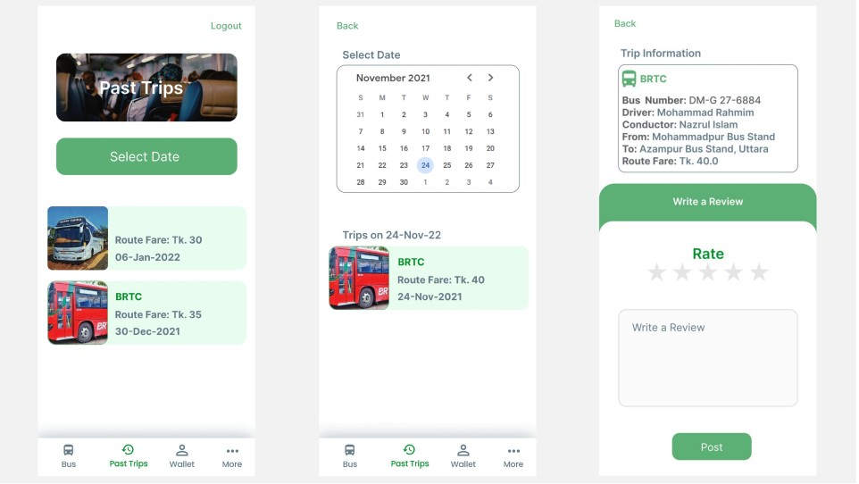
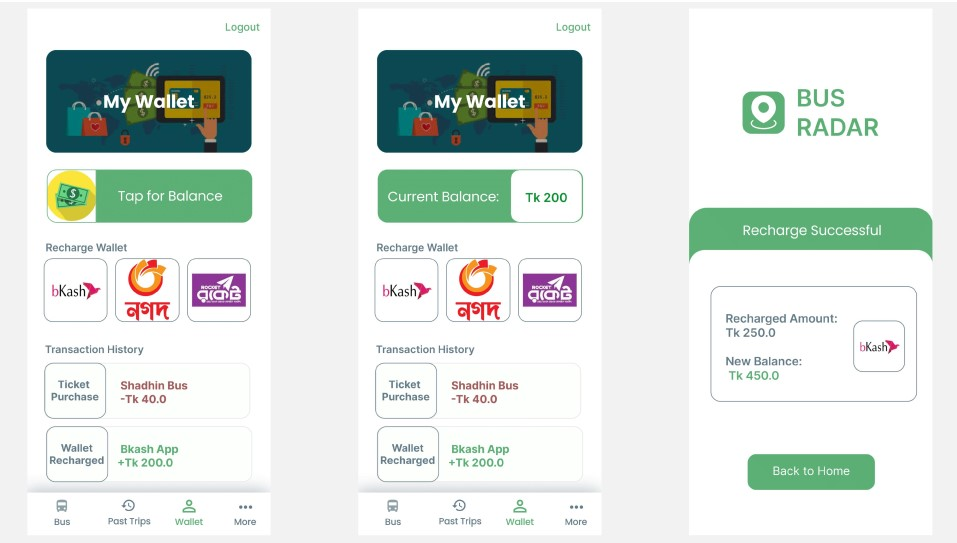

# Bus Radar Demonstration : CSE326 - Information System Design

## [See Full Report](Files/B2G5_Report.pdf)

### Choosing a Bus

### Choosing a Route

### Bus Information

### Buying Tickets

### Taking a Ride

### Past Trips

### Customer Wallet

